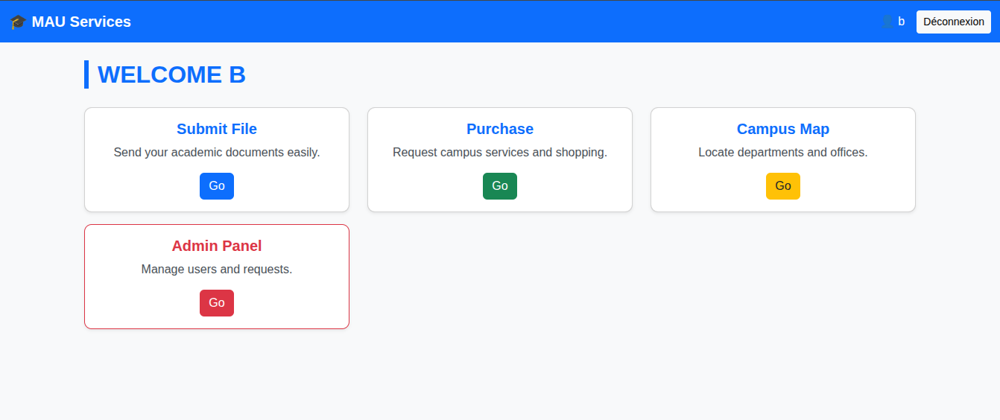
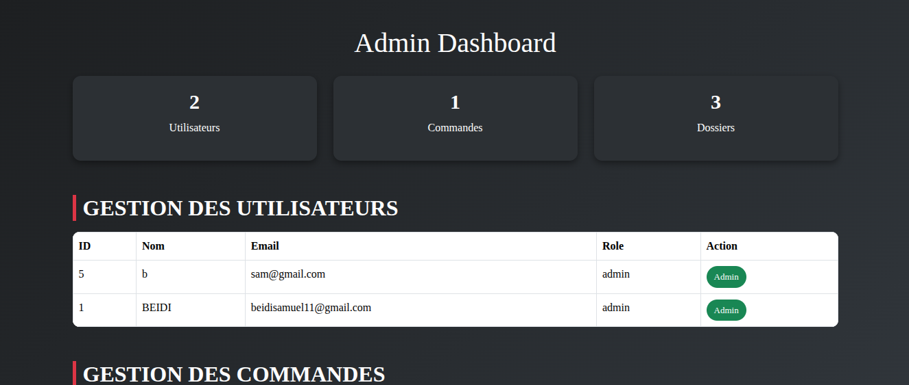
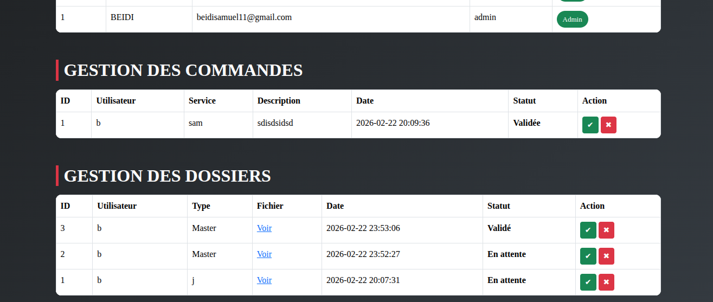

## Aperçu de l'application

### Dashboard

### Gestion des utilisateurs

### Gestion des commandes & dossiers

------------------------------------------------------------------------

## Fonctionnalités

-   Inscription & Connexion sécurisées
-   Gestion des rôles (admin / user)
-   Validation des commandes
-   Validation des dossiers
-   Dashboard administrateur avec statistiques

------------------------------------------------------------------------

## Technologies

-   PHP 8+
-   MySQL
-   Bootstrap 5
-   Apache (XAMPP)

------------------------------------------------------------------------

## Installation

1.  Cloner le projet
2.  Placer dans `htdocs/`
3.  Configurer la base de données dans `config/db.php`
4.  Donner les permissions au dossier uploads

------------------------------------------------------------------------

## Auteur

BEIDI DINA SAMUEL -- 2026
